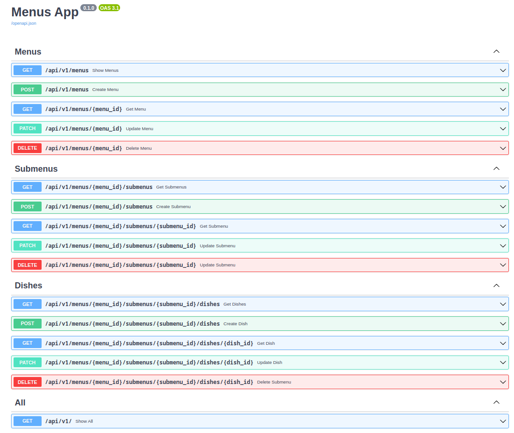

### Задание
Написать проект на FastAPI с использованием PostgreSQL в качестве БД.

Даны 3 сущности: Меню, Подменю, Блюдо.

Зависимости:

* У меню есть подменю, которые к ней привязаны.
* У подменю есть блюда.

#### Условия:
* Блюдо не может быть привязано напрямую к меню, минуя подменю.
* Блюдо не может находиться в 2-х подменю одновременно.
* Подменю не может находиться в 2-х меню одновременно.
* Если удалить меню, должны удалиться все подменю и блюда этого меню.
* Если удалить подменю, должны удалиться все блюда этого подменю.
* Цены блюд выводить с округлением до 2 знаков после запятой.
* Во время выдачи списка меню, для каждого меню добавлять кол-во подменю и блюд в этом меню.
* Во время выдачи списка подменю, для каждого подменю добавлять кол-во блюд в этом подменю.

### Как пользоваться:

1. Переименовать .env_example в .env и прописать свои переменные для postgres

2. Для сборки образа:

```
docker-compose build
```
3. Для запуска приложения:

* для простого запуска
```
docker-compose up -d
```
Теперь по адресу http://localhost:8000/ приложение будет доступно
* для запуска в режиме разработчика (hot reload)

```
docker-compose -f docker-compose.yml -f docker-compose.dev.yml up
```
Теперь можно отслеживать результаты изменения без перезапуска докера

4. Для остановки:
```
docker-compose down
```

### Как запустить тесты:
1. Переименовать .env_example в .env и прописать свои переменные для postgres. Убедитесь, что вы создали тестовую БД

2. Сборка тестового образа:
```
docker-compose -f docker-compose.tests.yml build
```
3. Запуск тестового образа:
```
docker-compose -f docker-compose.tests.yml up  --abort-on-container-exit
```
Контейнер остановиться автоматически после прогона тестов

< ------------------------------------------- >

### Спецификация OpenAPI

Спецификацию можно посмотреть после запуска приложения по адресу
http://localhost:8000/docs
или
http://localhost:8000/redoc

Также можно посмотреть на https://editor-next.swagger.io/ загрузив [файл](openapi.json)



Результаты тестов postman [тут](<menu app.postman_test_run.json>)
